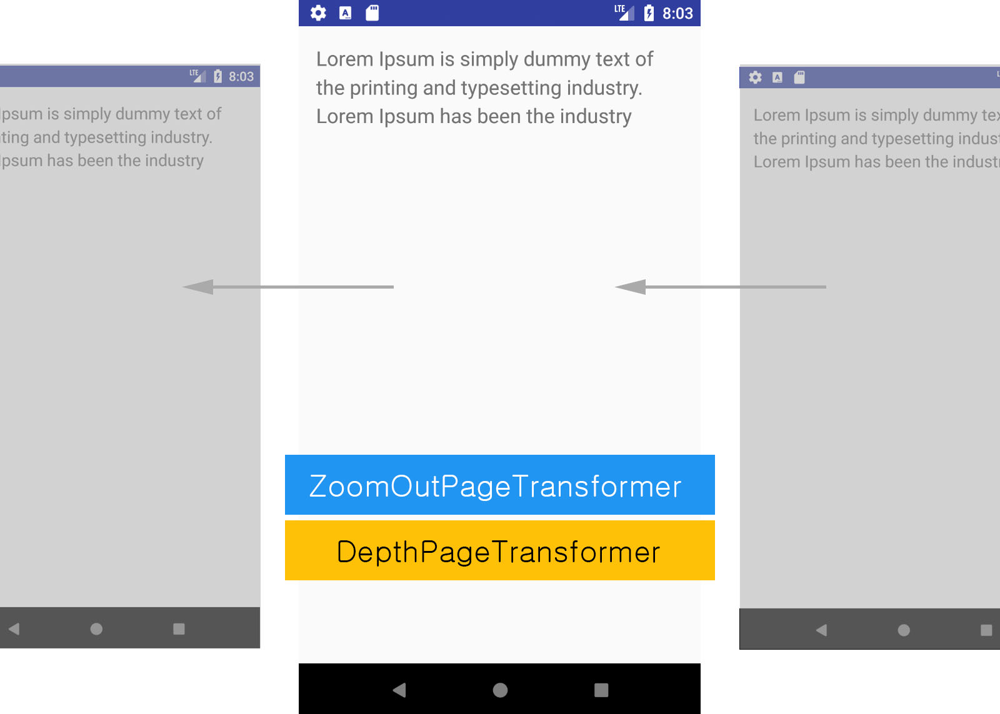

# Android-ViewPager

<h3>Description</h3>
<a href="https://developer.android.com/training/animation/screen-slide.html">Android Developer: ViewPager</a> 
<a href="https://developer.android.com/reference/android/support/v4/view/ViewPager.html">ViewPager</a>

<ul>
<li><b>ViewPager</b> is a ViewGroup object which is often used to present Fragments.</li>
<li> It has built in animation, and addition of PageTransformer adds various animation options.</li>
<li>This example implements <b>Zoom-Out</b> and <b>Depth-page</b> transformers.</li>
</ul>
